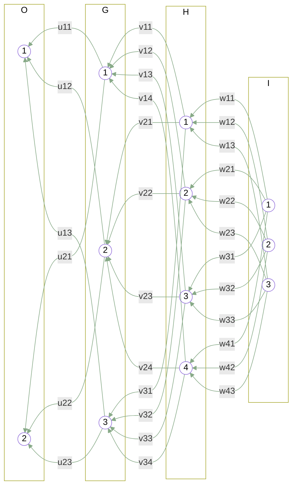



## intro
We can use Mermaid, a simple Markdown-like script language for generating charts from text via JavaScript (Mallin, 2018), to draw layers with nodes, where the diagram element used is circle and the feature of subgraph. But this would not be the main purpose of Mermaid, but we can use for it.

## model
+ From right to left it is a `2 <-- 3 <-- 4 <-- 3` architecture.
  - Note: Usual notation is from left to right as `3-4-3-2`.


flowchart RL
  i1--"w11"-->h1;i2--"w12"-->h1;i3--"w13"-->h1;
  i1--"w21"-->h2;i2--"w22"-->h2;i3--"w23"-->h2;
  i1--"w31"-->h3;i2--"w32"-->h3;i3--"w33"-->h3;
  i1--"w41"-->h4;i2--"w42"-->h4;i3--"w43"-->h4;
  
  h1--"v11"-->g1;h2--"v12"-->g1;h3--"v13"-->g1;h4--"v14"-->g1;
  h1--"v21"-->g2;h2--"v22"-->g2;h3--"v23"-->g2;h4--"v24"-->g2;
  h1--"v31"-->g3;h2--"v32"-->g3;h3--"v33"-->g3;h4--"v34"-->g3;
  
  g1--"u11"-->o1;g2--"u12"-->o1;g3--"u13"-->o1;
  g1--"u21"-->o2;g2--"u22"-->o2;g3--"u23"-->o2;
  
  subgraph I
    i1(("1"))
    i2(("2"))
    i3(("3"));
  end
  
  subgraph H
    h1(("1"))
    h2(("2"))
    h3(("3"))
    h4(("4"));
  end
  
  subgraph G
    g1(("1"))
    g2(("2"))
    g3(("3"))
  end
  
  subgraph O
    o1(("1"))
    o2(("2"))
  end
  
  classDef nodes fill:transparent, color:inherit
  classDef layers fill:none, color:inherit
  
  class i1,i2,i3 nodes
  class h1,h2,h3,h4 nodes
  class g1,g2,g3 nodes
  class o1,o2 nodes
  class I,H,G,O layers
  
  linkStyle default stroke:#8a8


## mermaid

## notes
+ Input, two hidden, and output layers, each is put in `subgraph`-`end` block.
+ Nodes are named without name of layers containing them for simplicity.
+ Weights `w`, `v`, `u` maps nodes and indicated with their sub-index.
  - e.g. `G2 <-- w23 -- H3`, where this means better from right to left.
+ CSS class is defined using `classDef` and later used using `class`.
+ For link or line connecting elements it style is modified via `linkStyle`.

## refs
+ Wallin M (2018) "Generating documentation as code with mermaid and PlantUML", Rule of Tech, url https://ruleoftech.com/2018/generating-documentation-as-code-with-mermaid-and-plantuml.
