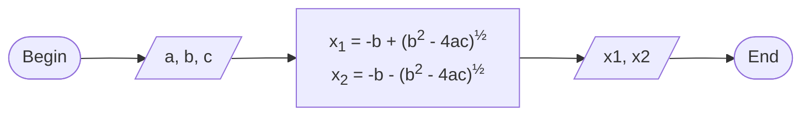

+++
title = 'have no idea'
date = 2024-04-05T20:32:00+07:00
draft = false
math = true
tags = []
url = '0001'
author = 'Sparisoma Viridi'
+++
A short story without any purposes <!--more-->

The same problem comes again and I follow the desire to make a new static site using [GitHub Pages](https://pages.github.com/). The last site is [o](https://dudung.github.io/o/), which still has the same style as this one. Usually, I become confused when there is already a lot of posts in a site, especially when it has various types of post that each have differents characteristics. Fortunately, a lot of posts are good for viewing how style works with many posts, that might look differently when only with few posts.

I just find out about how to make footnote[^1], which is very convenient for writing references. Thanks to Foster and Valero for the wiki page. What is still not so good looking is that the horizontal line preceeding the footnotes. Perhaps it can be controlled with CSS. It will be later handled. First I must finish this story, which does not has any purposes while writing it.

Equations. What does it have to do with equations? Well I like it and the first love in writing a post using [Jekyll](https://jekyllrb.com/) then [Hugo](https://gohugo.io/) is their support on [MathJax](https://www.mathjax.org/) for providing [LaTex](https://www.latex-project.org/) equations.

This is an inline math mode, e.g. $y = ax^2 + bx + c$, while

$$\tag{1}
x_{1,2} = \frac{-b \pm \sqrt{b^2 - 4ac}}{2a}
$$

is display math mode. In the first mode, equation is part of a paragraph, while in the second mode it has its own paragraph. Unfortunately, as fas as I know as about several months ago, link to an equation has not yet work.

LaTeX code for previous equations are

```tex
$y = ax^2 + bx + c$

$$\tag{1}
x_{1,2} = \frac{-b \pm \sqrt{b^2 - 4ac}}{2a}
$$
```

Eqn (1) can be calculated using any programming languages, e.g. Python, as follow

```python
# finding roots using quadratic formula
a = 1
b = -5
c = 6
x1 = -b + (b*b - 4*a*c)**0.5
x2 = -b - (b*b - 4*a*c)**0.5
print('x1 =', x1)
print('x2 =', x2)
```

From previous example you can see that the code uses the same symbols as in Eqn (2) in providing clear connection between the equation and the code, which can be considered as self-explanation feature, that will help the reader a lot.

Actually, above can can be first design using flowchart before code it. On of the possible flowchart is as follow.


flowchart LR
  B --> I --> P --> O --> E
  B(["Begin"])
  I[/"a, b, c"/]
  P["x<sub>1</sub> = -b + (b<sup>2</sup> - 4ac)<sup>&half;</sup>
  x<sub>2</sub> = -b - (b<sup>2</sup> - 4ac)<sup>&half;</sup>"]
  O[/"x<sub>1</sub>, x<sub>2</sub>"/]
  E(["End"])


The flowchart is created using [Mermaid](https://mermaid.js.org/), where



is the code.

## chart, music, molecules
Well, it is unusual to correlate chart, music, and molecules, right? But there are only feature that can be supported using this Hugo-based static site.

Let us show the chart, e.g. xy scatter? Well, it can be fascillitated using Chart.js and Hugo shortcode as follow.

```

B_XLABEL x
B_YLABEL y
B_SLABEL Data-1,Data-2,Data-3
B_PCOLOR #f88,#88f,#8f8
B_PRADII 4,6,0
B_LVISIB false,true,true
B_LCOLOR #f88,#88f,#8f8

5.000,3.000
4.902,3.618
4.618,4.176
4.176,4.618
3.618,4.902
3.000,5.000
2.382,4.902
1.824,4.618
1.382,4.176
1.098,3.618
1.000,3.000
1.098,2.382
1.382,1.824
1.824,1.382
2.382,1.098
3.000,1.000
3.618,1.098
4.176,1.382
4.618,1.824
4.902,2.382

12.000,3.000
11.934,3.624
11.741,4.220
11.427,4.763
11.007,5.229
10.500,5.598
9.927,5.853
9.314,5.984
8.686,5.984
8.073,5.853
7.500,5.598
6.993,5.229
6.573,4.763
6.259,4.220
6.066,3.624
6.000,3.000
6.066,2.376
6.259,1.780
6.573,1.237
6.993,0.771
7.500,0.402
8.073,0.147
8.686,0.016
9.314,0.016
9.927,0.147
10.500,0.402
11.007,0.771
11.427,1.237
11.741,1.780
11.934,2.376

9.000,2.000
8.809,2.588
8.309,2.951
7.691,2.951
7.191,2.588
7.000,2.000
7.191,1.412
7.691,1.049
8.309,1.049
8.809,1.412

```

which produces


B_XLABEL x
B_YLABEL y
B_SLABEL Data-1,Data-2,Data-3
B_PCOLOR #f88,#88f,#8f8
B_PRADII 4,6,0
B_LVISIB false,true,true
B_LCOLOR #f88,#88f,#8f8

5.000,3.000
4.902,3.618
4.618,4.176
4.176,4.618
3.618,4.902
3.000,5.000
2.382,4.902
1.824,4.618
1.382,4.176
1.098,3.618
1.000,3.000
1.098,2.382
1.382,1.824
1.824,1.382
2.382,1.098
3.000,1.000
3.618,1.098
4.176,1.382
4.618,1.824
4.902,2.382

12.000,3.000
11.934,3.624
11.741,4.220
11.427,4.763
11.007,5.229
10.500,5.598
9.927,5.853
9.314,5.984
8.686,5.984
8.073,5.853
7.500,5.598
6.993,5.229
6.573,4.763
6.259,4.220
6.066,3.624
6.000,3.000
6.066,2.376
6.259,1.780
6.573,1.237
6.993,0.771
7.500,0.402
8.073,0.147
8.686,0.016
9.314,0.016
9.927,0.147
10.500,0.402
11.007,0.771
11.427,1.237
11.741,1.780
11.934,2.376

9.000,2.000
8.809,2.588
8.309,2.951
7.691,2.951
7.191,2.588
7.000,2.000
7.191,1.412
7.691,1.049
8.309,1.049
8.809,1.412


as the result. With this feature you can have a chart and also the data at the same time. Availability access to the data for the chart can be considered as advantage or disadvantage. That depends on what we considere.

Now, it is time for musical notes.


X:1
T:Twinkle Twinkle Little Star
K:C
L:1/4
CC GG | AA G2 | CC GG | AA G2 |
w:Twin- kle, twin- kle, lit- tle star how I won- der what you are!
GG FF | EE D2 | GG FF | EE D2 |
w:Up a- bove the world so high, like a dia- mond in the sky.
CC GG | AA G2 | FF EE | DD C2 ||
w:Twin- kle, twin- kle, lit- tle star, how I won- der what you are!


The notes can be displayed using [abcjs](https://www.abcjs.net/), a JS library, combined with Hugo shortcode.


```

X:1
T:Twinkle Twinkle Little Star
K:C
L:1/4
CC GG | AA G2 | CC GG | AA G2 |
w:Twin- kle, twin- kle, lit- tle star how I won- der what you are!
GG FF | EE D2 | GG FF | EE D2 |
w:Up a- bove the world so high, like a dia- mond in the sky.
CC GG | AA G2 | FF EE | DD C2 ||
w:Twin- kle, twin- kle, lit- tle star, how I won- der what you are!

```

I choose the song because it is simple and the only song that I remember the notes. Well, I am not good in musics, but I like to play it. But, of course, just for my self, since it will, Unfortunately, noise to the others ☹️.

Well, last but not the least is the molecules. We can display molecules in a post as follow.


21
Aspirin
O    1.2333    0.5540    0.7792
O   -0.6952   -2.7148   -0.7502
O    0.7958   -2.1843    0.8685
O    1.7813    0.8105   -1.4821
C   -0.0857    0.6088    0.4403
C   -0.7927   -0.5515    0.1244
C   -0.7288    1.8464    0.4133
C   -2.1426   -0.4741   -0.2184
C   -2.0787    1.9238    0.0706
C   -2.7855    0.7636   -0.2453
C   -0.1409   -1.8536    0.1477
C    2.1094    0.6715   -0.3113
C    3.5305    0.5996    0.1635
H   -0.1851    2.7545    0.6593
H   -2.7247   -1.3605   -0.4564
H   -2.5797    2.8872    0.0506
H   -3.8374    0.8238   -0.5090
H    3.7290    1.4184    0.8593
H    4.2045    0.6969   -0.6924
H    3.7105   -0.3659    0.6426
H   -0.2555   -3.5916   -0.7337


using following code

```

21
Aspirin
O    1.2333    0.5540    0.7792
O   -0.6952   -2.7148   -0.7502
O    0.7958   -2.1843    0.8685
O    1.7813    0.8105   -1.4821
C   -0.0857    0.6088    0.4403
C   -0.7927   -0.5515    0.1244
C   -0.7288    1.8464    0.4133
C   -2.1426   -0.4741   -0.2184
C   -2.0787    1.9238    0.0706
C   -2.7855    0.7636   -0.2453
C   -0.1409   -1.8536    0.1477
C    2.1094    0.6715   -0.3113
C    3.5305    0.5996    0.1635
H   -0.1851    2.7545    0.6593
H   -2.7247   -1.3605   -0.4564
H   -2.5797    2.8872    0.0506
H   -3.8374    0.8238   -0.5090
H    3.7290    1.4184    0.8593
H    4.2045    0.6969   -0.6924
H    3.7105   -0.3659    0.6426
H   -0.2555   -3.5916   -0.7337

```

with the help of JS library known as [3Dmol.js](https://3dmol.csb.pitt.edu/) from University of Pittsburgh. By the way, it is a aspirin molecule [^2].


## others
Following are other features without clear explanation.

### path

B_STYLE red,3,none # resistor 1
M 40 30
l 40 0 l 2.5 10
l 5 -20 l 5 20 l 5 -20 l 5 20 l 5 -20 l 5 20 l 5 -20
l 2.5 10 l 40 0

B_STYLE green,3,none # resistor 2
M 160 30
l 0 40 l 10 2.5 
l -20 5  l 20 5 l -20 5 l 20 5 l -20 5 l 20 5 l -20 5
l 10 2.5 l 0 40

B_STYLE blue,3,none # resistor 3
M 160 150
l -40 0 l -2.5 10
l -5 -20 l -5 20 l -5 -20 l -5 20 l -5 -20 l -5 20 l -5 -20
l -2.5 10 l -40 0

B_STYLE cyan,3,none # battery 1
M 40 150
l 0 -50
m -8 0 l 16 0
m -8 -10 l -20 0 l 40 0
m 0 -10 l 0 -10 m -5 5 l 10 0
m -25 15 l 0 -60 


```

B_STYLE red,3,none # resistor 1
M 40 30
l 40 0 l 2.5 10
l 5 -20 l 5 20 l 5 -20 l 5 20 l 5 -20 l 5 20 l 5 -20
l 2.5 10 l 40 0

B_STYLE green,3,none # resistor 2
M 160 30
l 0 40 l 10 2.5 
l -20 5  l 20 5 l -20 5 l 20 5 l -20 5 l 20 5 l -20 5
l 10 2.5 l 0 40

B_STYLE blue,3,none # resistor 3
M 160 150
l -40 0 l -2.5 10
l -5 -20 l -5 20 l -5 -20 l -5 20 l -5 -20 l -5 20 l -5 -20
l -2.5 10 l -40 0

B_STYLE cyan,3,none # battery 1
M 40 150
l 0 -50
m -8 0 l 16 0
m -8 -10 l -20 0 l 40 0
m 0 -10 l 0 -10 m -5 5 l 10 0
m -25 15 l 0 -60 

```

### data block

1
2
3

1,4,16
2,32,64

10,100
20,200
30,300
40,400

1,2,3,4,5,6
7,8,9,0,9,8
7,6,5,4,3,2
1,0,1,2,3,4
5,6,7,8,9,0


```

1
2
3

1,4,16
2,32,64

10,100
20,200
30,300
40,400

1,2,3,4,5,6
7,8,9,0,9,8
7,6,5,4,3,2
1,0,1,2,3,4
5,6,7,8,9,0

```

Most of above codes are published previously in a post on o[^3], where [blank](https://dudung.github.io/blank/) is another project before [o](https://dudung.github.io/o/).


flowchart RL
  B --> O --> T
  B(("blank"))
  O(("o"))
  T(("to"))
  click T "https://dudung.github.io/to/" _blank
  click O "https://dudung.github.io/o/" _blank
  click B "https://dudung.github.io/blank/" _blank



## features
By the way, I add reading time and author to `single.html` from
+ -, "Reading time", Hugo Codex, url https://hugocodex.org/add-ons/reading-time/ [20240405].
+ McShelby, "Displaying author and date in content", Hugo, 30 Aug 2021, url https://discourse.gohugo.io/t/displaying-author-and-date-in-content/34505/6 [20240405].

It can only support single author. It requires futher study to find the support for multiple authors shown in a post. And

+ kascme, "Footnote styling", Hugo, 17 Jan 2019, url https://discourse.gohugo.io/t/footnote-styling/114/8 [20240405].
+ aeonfr, "Footnote styling:", Hugo, 19 Jul 1017, url https://discourse.gohugo.io/t/footnote-styling/114/7 [20240405].

are some style changes for footnotes.


## markdown
I think I might later write about examples of using Markdown in this part. Well, it might be happend or it might be not.

No | First Name | Last Name
:-: | :- | :-
1 | Mister | Nobody
2 | Jane | Doe
3 | Fulana | Fulan
4 | Nate | Avail

Above table is obtained using

```md
No | First Name | Last Name
:-: | :- | :-
1 | Mister | Nobody
2 | Jane | Doe
3 | Fulana | Fulan
4 | Nate | Avail
```

as the Markdown code. Following icon in PNG format


can be viewed using following code

```md

```

Then how about list?

+ Animal
  - Swim
    - Fish
  - Run
    - Cheetah
  - Fly
    + Bird
      - Shorebirds
      - Falcons
        + Prairie
        + Peregrine
    + Butterfly
+ Plantation
  - Creeper
  - Climbing
  - Herbs
    + Tomato
      - Cherry
      - Grape
      - Roma
      - Green
    + Wheat
    + Paddy
    + Cabbage
  - Shrub
  - Tree

Above list is obtained using following lines of Markdown code

```md
+ Animal
  - Swim
    - Fish
  - Run
    - Cheetah
  - Fly
    + Bird
      - Shorebirds
      - Falcons
        + Prairie
        + Peregrine
    + Butterfly
+ Plantation
  - Creeper
  - Climbing
  - Herbs
    + Tomato
      - Cherry
      - Grape
      - Roma
      - Green
    + Wheat
    + Paddy
    + Cabbage
  - Shrub
  - Tree
```

What is the following?

> When one door closes, another opens;
> but we often look so long and so regretfully
> upon the closed door that we do not see the
> one which has opened for us

> (Alexander Graham Bell)

It is a quote and the above appearance is obtained using following code

```md
> When one door closes, another opens;
> but we often look so long and so regretfully
> upon the closed door that we do not see the
> one which has opened for us

> (Alexander Graham Bell)
```

:x: :wave:

Hello! :wave:

## closing
+ `05-may-2024` It is 2310 now and I am tired. This post will be continued tomorrow early morning, while performing sahur, hopefully. I have to go to bed now.
+ `06-may-2024` A new post [0002](../0002) is being created. Perhaps the Markdown part of this post will also be the same. Today the other post will be the focus and not this one.


## notes
[^1]: Helen Foster, German Valero, "Advanced use of Markdown", Moodle Docs, 21 Feb 2024 15:24, url https://docs.moodle.org/403/en/index.php?oldid=147883 [20240405].
[^2]: National Center for Biotechnology Information (2024), PubChem Compound Summary for CID 2244, Aspirin, url https://pubchem.ncbi.nlm.nih.gov/compound/Aspirin [20240405].
[^3]: Viridi S (2024) "some features on hugo", GitHub, 1 Mar 2024, url https://dudung.github.io/o/posts/if3110/some-features-on-hugo/ [20240405].
